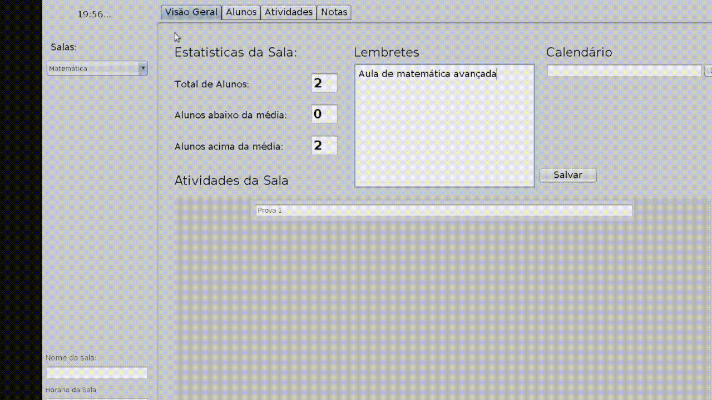
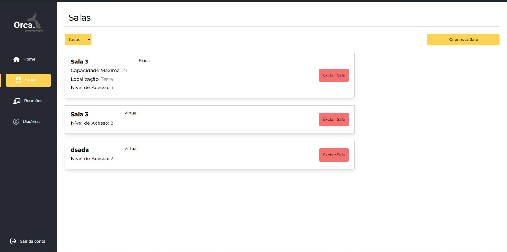

# Pedro Henrique Pucci

## Introdução

  

Meu nome é Pedro Henrique Pucci, moro em Taubaté, e atualmente estou no 5º semestre do curso de Análise e Desenvolvimento de Sistemas na FATEC de São José dos Campos. Sempre fui apaixonado por tecnologia e soube que gostaria de seguir carreira nesta área. Meu primeiro contato com a programação foi em um workshop oferecido por uma empresa na minha cidade. Depois disso, participei do curso Técnico de Desenvolvimento de Sistemas no SENAI Taubaté, onde entrei de cabeça no mundo da programação e desenvolvimento de software. Finalizado o curso técnico e o ensino médio, entrei para a FATEC, onde estarei concluindo minha graduação.

## Contatos
* 
* 

## Meus Principais Conhecimentos

#### Linguagens
- TypeScript 
- Python 
- Java 
- PHP 
- C 
- HTML 
- CSS 
- JavaScript 

#### Back-end
- NodeJS 
- Express 
- Jest 
- Flask 
- TypeORM 

#### Front-end

- React 
- React Native 
- Vue 
  
#### Banco De Dados
- PostgreSQL 
- MySQL 
- MongoDB 

#### Plataformas de nuvem
- AWS 
- Firebase 

#### Outras ferramentas
- Git 
- Postman 

## Meus Projetos

1º Semestre

 

***08/2022***  
***FATEC São José dos Campos***  
***Jean Carlos Lourenço Costa***  
A proposta do projeto era desenvolver uma aplicação para gerenciar os chamados de ordens de serviços dos computadores dos laboratórios da FATEC.  
Para isso, desenvolvimos um site que exibe todos os laboratórios da faculdade e todos os computadores que estão neles. Também é possível visualizar quais computadores tem problemas relatados e se uma ordem de serviço já foi aberta para ele. Também é possível entrar no modo Técnico, onde o usuário pode visualizar as ordens de serviços abertas, fechá-las quando o problema for reparado e ainda reorganizar a disposição dos computadores nos laboratórios através do editor de laboratórios, além de uma tela de estatísticas exibindo os problemas mais comums, quais computadores são mais afetados, quais laboratórios recebem mais chamados e mais.  

**[Repositório](https://github.com/pedro11pucci/API_MirageGroup)**  

### Tecnologias Utilizadas  

- Python : A linguagem Python foi usada para todas as funções de backend, desde criação de rotas até conexões com o banco de dados.
- Flask : O framework Flask foi utilizado para criar as rotas, tanto do frontend quanto do backend.
- HTML  CSS  JavaScript : O HTML, CSS e JavaScript foram usados para fazer o frontend, desde o layout das páginas, a estilização dos elementos e as funcionalidades mais complexas, como o editor de laboratórios.
- MySQL : O banco de dados MySQL foi usado para armazenar os dados da aplicação. Esses são os laboratórios que existem, quais computadores estão em quais laboratórios, problemas relatados nesses computadores, a disposição deles nos laboratórios, os chamados abertos, os chamados fechados e as estatísticas.

### Minhas Contribuições Pessoais  

- **Criação do banco de dados**: Fui o responsável por modelar o banco de dados, criar as relações entre as entidades e implementá-lo na aplicação.
- **Sistema de chamados**: Trabalhei no sistema de abertura e fechamento de chamados, que permite o usuário visualizar os computadores do laboratório, escolher o que apresenta defeitos, reportar o defeito dele, exibir ao usuário técnico qual computador de qual laboratório está com qual defeito e fechar o chamado após o problema ser resolvido.
- **Editor de laboratórios**: Criei o editor de laboratórios, que permite reorganizar a disposição dos computadores de um laboratório, assim como adicionar ou remover computadores dele, e salvar as alterações de modo que elas sejam exibidas para os usuários não-técnicos.

### Hard Skills

- Utilização do **Flask**  para criação de rotas da aplicação, utilizando diferentes métodos HTTP e parâmetros de URL e de requisição.
- Utilização do **JavaScript DOM**  para a criação de funcionalidades dinâmicas com interação do usuário.
- **Transações** complexas com o banco de dados **MySQL** 

### Soft Skills

- **Gerenciamento de uma equipe Scrum**: Utilizamos a metodologia ágil Scrum para desenvolver o projeto, o que requiriu um comprometimento e regularidade de presença em dailys e entrega de tasks de todos os membros da equipe.
- **Scrum Master**: Como o Scrum Master da equipe, precisei estar atento as contribuições de todos os membros do projeto, para garantir que tudo estava de acordo com o planejamento da sprint e, caso necessário, oferecer minha ajuda.

2º Semestre

 

***03/2023***  
***FATEC São José dos Campos***  
***Cláudio Etelvino de Lima***  
A proposta do projeto era desenvolver uma plataforma de gestão de salas de aula, como poder registrar alunos, turmas, atribuições de tarefas e distribuição de notas.  
Para isso, criamos uma aplicação desktop que é possível de ser instalada em qualquer computador para que o professor possa gerenciar suas turmas de qualquer lugar.

**[Repositório](https://github.com/MirageGroup/API_MirageGroup_2sem)**  

### Tecnologias Utilizadas  

- Java : A linguagem Java, junto com o framework Java Swing, foi utilizada para criar toda a base da aplicação, desde a interface até as conexões com o banco de dados.
- MySQL : O banco de dados MySQL foi usado para armazenar os dados da aplicação. Esses são os alunos cadastrados, as turmas, as atividades e as notas.

### Minhas Contribuições Pessoais  

- **Criação do banco de dados**: Fui o responsável por modelar o banco de dados, criar as relações entre as entidades e implementá-lo na aplicação.
- **Atribuição de tarefas**: Fui o responsável por criar o sistema de atribuição de tarefas aos alunos das turmas.

### Hard Skills

- Utilização do **Java Swing**  para criação de interface de uma aplicação desktop, algo que não estávamos acostumados a fazer.

### Soft Skills

- **Gerenciamento de uma equipe Scrum**: Utilizamos a metodologia ágil Scrum para desenvolver o projeto, o que requiriu um comprometimento e regularidade de presença em dailys e entrega de tasks de todos os membros da equipe.

3º Semestre

 

***08/2023***  
***IONIC Health***  
***Cláudio Etelvino de Lima***  
A proposta do projeto era desenvolver uma aplicação para fazer a gestão de equipes, de processos de desenvolvimento, de tasks e de armazenação das evidências dessas tasks.  
Para isso, desenvolvimos uma aplicação onde o usuário pode logar, visualizar suas equipes, os processos aos quais ele está atribuído, quais tasks e deve realizar e armazenar evidências do cumprimento dessas tasks. Pode também logar um usuário gestor, que pode cadastrar novos usuários, criar novas equipes, novos processos, atribuir equipes a estes processos e criar tasks dentro dos mesmos.  

**[Repositório](https://github.com/MirageGroup/API_MirageGroup_3sem)**  

### Tecnologias Utilizadas  

- TypeScript : O TypeScript foi utilizado tanto no backend, para criar a API REST que se conecta com o banco de dados, quanto no frontend, para desenvolver a interface do site utilizando React.
- React : O React foi utilizado para desenvolver o frontend da aplicação.
- Express : O Express foi o framework web utilizado para criar e rodar o backend da aplicação.
- TypeORM : O TypeORM foi utilizado para fazer o mapeamento a relação das entidades do banco de dados com o aplicativo e fazer as transações com o banco de dados.
- MySQL : O banco de dados MySQL foi usado para armazenar os dados da aplicação.
- AWS : Utilizamos o serviço S3 da plataforma AWS para fazer o armazenamento dos arquivos de evidências das tasks.

### Minhas Contribuições Pessoais  

- **Criação do banco de dados**: Fui o responsável por modelar o banco de dados, criar as relações entre as entidades e implementá-lo na aplicação.
- **Armazenamento de evidências**: Criei o sistema de armazenamento das evidências das tasks, que faz o upload de arquivos através de uma requisição para uma instância S3 da AWS e depois armazena o link de acesso do arquivo armazenado no banco de dados MySQL.

### Hard Skills

- Utilização de serviços **AWS**  que são externos a aplicação principal.

### Soft Skills

- **Gerenciamento de uma equipe Scrum**: Utilizamos a metodologia ágil Scrum para desenvolver o projeto, o que requiriu um comprometimento e regularidade de presença em dailys e entrega de tasks de todos os membros da equipe.
- **Scrum Master**: Como o Scrum Master da equipe, precisei estar atento as contribuições de todos os membros do projeto, para garantir que tudo estava de acordo com o planejamento da sprint e, caso necessário, oferecer minha ajuda.

4º Semestre

 

***03/2024***  
***SIATT***  
***Fabiano Sabha Walczak***  
A proposta do projeto era desenvolver uma aplicação de gestão de reuniões da empresa.  
Para isso, desenvolvemos um site onde o usuário pode logar, ver as reuniões as quais ele está atribuído, criar reuniões próprias

**[Repositório](https://github.com/MirageGroup/API_MirageGroup_4sem)**  

### Tecnologias Utilizadas  

- TypeScript : O TypeScript foi utilizado tanto no backend, para criar a API REST que se conecta com o banco de dados, quanto no frontend, para desenvolver a interface do site utilizando React.
- React : O React foi utilizado para desenvolver o frontend da aplicação.
- Express : O Express foi o framework web utilizado para criar e rodar o backend da aplicação.
- TypeORM : O TypeORM foi utilizado para fazer o mapeamento a relação das entidades do banco de dados com o aplicativo e fazer as transações com o banco de dados.
- MySQL : O banco de dados MySQL foi usado para armazenar os dados da aplicação.
- AWS : Utilizamos o serviço S3 da plataforma AWS para fazer o armazenamento das atas das reuniões.

### Minhas Contribuições Pessoais  

- **Criação do banco de dados**: Fui o responsável por modelar o banco de dados, criar as relações entre as entidades e implementá-lo na aplicação.
- **Armazenamento de ata**: Criei o sistema de armazenamento das atas das reuniões, que faz o upload de arquivos através de uma requisição para uma instância S3 da AWS e depois armazena o link de acesso do arquivo armazenado no banco de dados MySQL.
- **Sistema de cadastro com verificação em cascata**: Sistema de cadastro dos participantes das reuniões que verifica se o participante já está cadastrado em uma reunião naquele horário, se a sala já está reservada para aquele horário, até qual horário etc...

### Hard Skills

- Utilização de serviços **AWS**  que são externos a aplicação principal.

### Soft Skills

- **Gerenciamento de uma equipe Scrum**: Utilizamos a metodologia ágil Scrum para desenvolver o projeto, o que requiriu um comprometimento e regularidade de presença em dailys e entrega de tasks de todos os membros da equipe.

